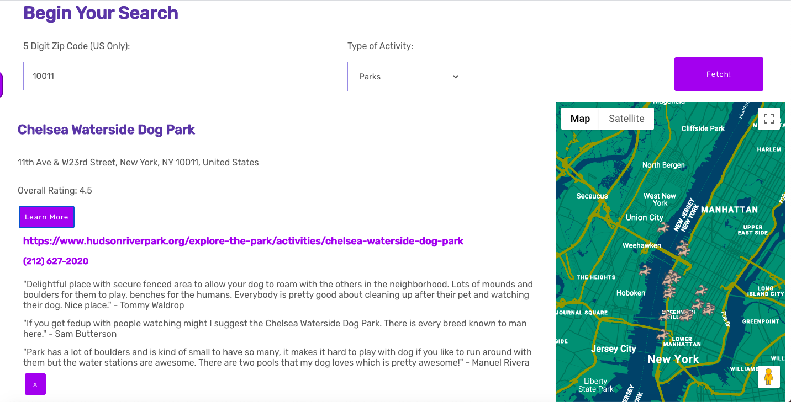

# DoggosWelcome

An app that helps you discover dog-friendly activities across any zip code in the U.S!

# Features

* Search that allows user to find bars, dog parks, trails, brunch spots and much more through zip code and type of activtiy user inputs.
* Personal dashboard that allows user to save/favorite searches. 
* Recommend Form that allows user to submit a/their business and add to doggoWelcome's search directory. 

# Screenshots

Landing page:


# Doggo Search 




# Dashboard 


# Recommend 


# API Endpoints

## Users and Authentication

### POST
- /api/login (login)
- /api/signup (sign Up)

## Search

### POST
- /api/search (doggoSearch - requests to Google Places and Places Details API)

## Dashboard

### GET
- /api/:username/dashboard (gets user's saved searches)

### DELETE
- /api/:username/dashboard/:id (deletes a saved spot from user's dashboard)


# Environment Set Up

* Setup your own postgress server
* Run the sql scripts in migration folder to build your table structure. Server repo : https://github.com/sailasantana/capstone-2-server-v2
* Create a .env file in your server folder which contains the path to your database as well as your Google API key and jwt secret
* Obtain a Google API key by setting up your app with the google developers console
* Run your project with : ```npm run dev```


# Run Tests

* To run all tests, run : ```npm test```


# Built With

## Front-End
* React
* React Hooks 
* React-Router
* Google Maps API
* HTML5 and CSS3

## Back-End
* Nodejs
* PostgreSQL
* Google Places API, Google Places Details, API
* Knex.js
* Express.js

## Testing

* Supertest
* Chai
* Mocha
* Jest


# Acknowledgments

* Art work from The New York Times